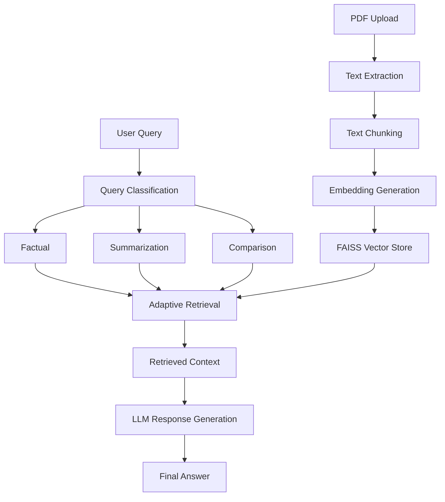
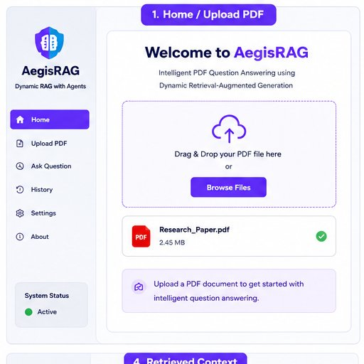
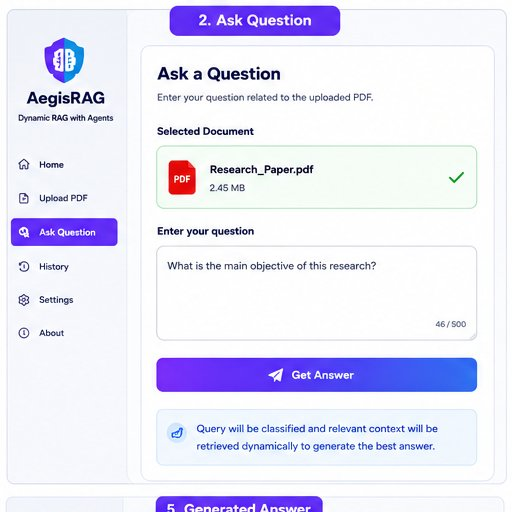
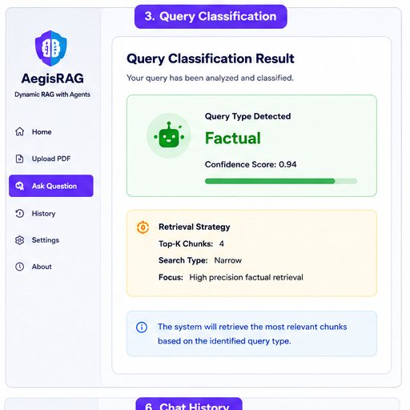
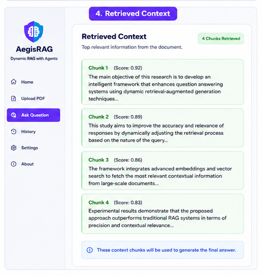
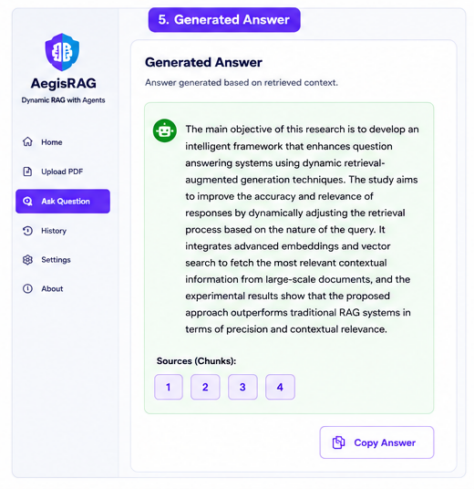
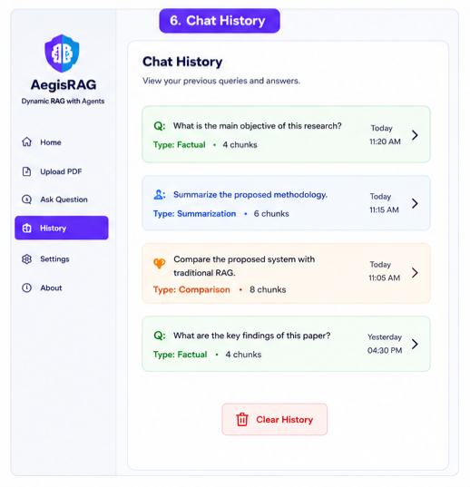

# 🛡️ AegisRAG

<div align="center">

### Query-Adaptive Dynamic Retrieval-Augmented Generation for PDF Question Answering

[]()
[]()
[]()
[]()
[]()

[](https://huggingface.co/spaces/ArunabhoCodes/AegisRAG)

### Intelligent PDF Question Answering using Dynamic Retrieval-Augmented Generation

</div>

---

## 📌 Overview

**AegisRAG** is a Query-Adaptive Dynamic Retrieval-Augmented Generation (RAG) framework designed to improve contextual relevance and retrieval efficiency for PDF-based question answering.

Unlike traditional RAG systems that use a fixed retrieval strategy for every query, AegisRAG first classifies the user's intent and dynamically adapts retrieval depth and context selection to generate more accurate and context-aware answers.

The system leverages:

* Semantic Search
* Query Classification
* Dynamic Retrieval Strategies
* FAISS Vector Database
* Large Language Models (LLMs)
* Streamlit-Based Interactive Interface

---

## 🌐 Live Demo

🔗 **Deployment:** YOUR_DEPLOYMENT_LINK

Upload a PDF and ask questions in natural language to receive context-aware responses.

---

# ✨ Key Features

## 📄 Smart PDF Processing

* Upload PDF documents
* Automatic text extraction
* Intelligent document chunking
* Embedding generation
* Semantic indexing

---

## 🧠 Query Classification

Automatically classifies queries into:

* 📌 Factual Questions
* 📖 Summarization Requests
* ⚖️ Comparison Queries

---

## 🔍 Dynamic Retrieval

Instead of using a fixed retrieval depth:

```text
Factual Query
      ↓
Retrieve Few Highly Relevant Chunks

Summarization Query
      ↓
Retrieve Larger Context Window

Comparison Query
      ↓
Retrieve Context From Multiple Sections
```

This improves retrieval efficiency while reducing retrieval noise.

---

## ⚡ Semantic Search

* Embedding-based retrieval
* Context-aware search
* Meaning-based matching
* Vector similarity search using FAISS

---

## 🤖 AI Answer Generation

* Context-grounded responses
* Reduced hallucinations
* Improved factual accuracy
* Better contextual relevance

---

## 📚 Chat History

* Stores previous conversations
* Tracks query classifications
* Displays retrieval statistics

---

# 🏗️ System Architecture



---

## 🖼️ Architecture Diagram


---

# 📸 Application Screenshots

## 1️⃣ Upload PDF

<p align="center">
  
</p>

Upload research papers, reports, manuals, or any PDF document for semantic analysis.

---

## 2️⃣ Ask Questions

<p align="center">
  
</p>

Ask questions directly from uploaded documents using natural language.

---

## 3️⃣ Query Classification

<p align="center">
  
</p>

The system automatically determines the query category and selects the appropriate retrieval strategy.

---

## 4️⃣ Retrieved Context

<p align="center">
  
</p>

Displays the most relevant chunks retrieved from the document along with similarity scores.

---

## 5️⃣ Generated Answer

<p align="center">
  
</p>

Generates grounded answers using retrieved contextual information.

---

## 6️⃣ Chat History

<p align="center">
  
</p>

Track previous queries, retrieval details, and generated responses.

---

# 🔬 Why Dynamic RAG?

## Traditional RAG

```text
User Query
      ↓
Fixed Retrieval
      ↓
LLM
      ↓
Answer
```

### Problems

* Retrieval Noise
* Static Context Window
* Irrelevant Chunks
* Poor Adaptability
* Fixed Retrieval Depth

---

## AegisRAG Approach

```text
User Query
      ↓
Query Classification
      ↓
Adaptive Retrieval Strategy
      ↓
Semantic Retrieval
      ↓
LLM Generation
      ↓
Context-Aware Answer
```

### Benefits

✅ Better Context Relevance

✅ Reduced Hallucinations

✅ Adaptive Retrieval Depth

✅ Improved Retrieval Efficiency

✅ Query-Aware Context Selection

✅ Higher Answer Quality

---

# 🚧 Challenges Solved

* Dynamic retrieval selection based on query intent
* Reduction of retrieval noise
* Adaptive Top-K retrieval
* Efficient semantic PDF search
* Context-aware answer generation
* Lightweight Dynamic RAG implementation

---

# 🛠️ Tech Stack

### Frontend

* Streamlit

### Backend

* Python

### Retrieval Layer

* FAISS
* Sentence Transformers

### NLP & AI

* LangChain
* Hugging Face Embeddings
* Large Language Models (LLMs)

### Document Processing

* PyPDF
* Recursive Character Text Splitter

### Vector Search

* FAISS Similarity Search

---

# 📂 Project Structure

```bash
AegisRAG/
│
├── src/
├── tests/
├── web/
│
├── app.py
├── web_app.py
├── requirements.txt
├── pyproject.toml
├── Dockerfile
├── README.md
│
├── assets/
│   ├── architecture.png
│   ├── AegisRAG_1_Home_Upload_PDF.png
│   ├── AegisRAG_2_Ask_Question.png
│   ├── AegisRAG_3_Query_Classification.png
│   ├── AegisRAG_4_Retrieved_Context.png
│   ├── AegisRAG_5_Generated_Answer.png
│   └── AegisRAG_6_Chat_History.png
│
└── README.md
```

---

# 🚀 Installation

### Clone Repository

```bash
git clone https://github.com/YOUR_USERNAME/AegisRAG.git
cd AegisRAG
```

### Install Dependencies

```bash
pip install -r requirements.txt
```

### Run Application

```bash
streamlit run app.py
```

---

# 📊 Performance Highlights

| Metric             | Traditional RAG | AegisRAG |
| ------------------ | --------------- | -------- |
| Query Awareness    | ❌               | ✅        |
| Retrieval Depth    | Fixed           | Dynamic  |
| Context Selection  | Static          | Adaptive |
| Retrieval Noise    | High            | Reduced  |
| PDF QA Performance | Moderate        | Improved |
| Context Relevance  | Medium          | High     |

---

# 🔑 Skills Demonstrated

* Retrieval-Augmented Generation (RAG)
* Dynamic RAG
* Semantic Search
* Vector Databases
* FAISS
* LangChain
* Large Language Models
* NLP
* Information Retrieval
* Prompt Engineering
* Streamlit
* Python
* AI Application Development

---

# 🎯 Future Enhancements

* Multi-PDF Retrieval
* Hybrid Search (BM25 + Vector Search)
* Agentic RAG Workflow
* Web Search Integration
* Citation Generation
* Reranking Models
* Multimodal RAG
* Knowledge Graph Integration
* Real-Time Information Retrieval

---

# 👨‍💻 Authors

### Team AegisRAG

* Joshita Bhattacharyya
* Rohan Roy
* Arunabho Garai

Developed as part of the Bachelor of Technology Degree Program.

---

# 📜 Research Contribution

**AegisRAG** introduces a query-adaptive Dynamic RAG framework that improves contextual relevance and retrieval efficiency for PDF-based question answering systems through adaptive retrieval strategies and query-aware retrieval mechanisms.

---

# ⭐ Support

If you found this project useful:

⭐ Star the repository

🍴 Fork the project

🛠️ Contribute improvements

📢 Share it with others

---

<div align="center">

### Built with ❤️ using AI, RAG, FAISS, Streamlit & LLMs

</div>
